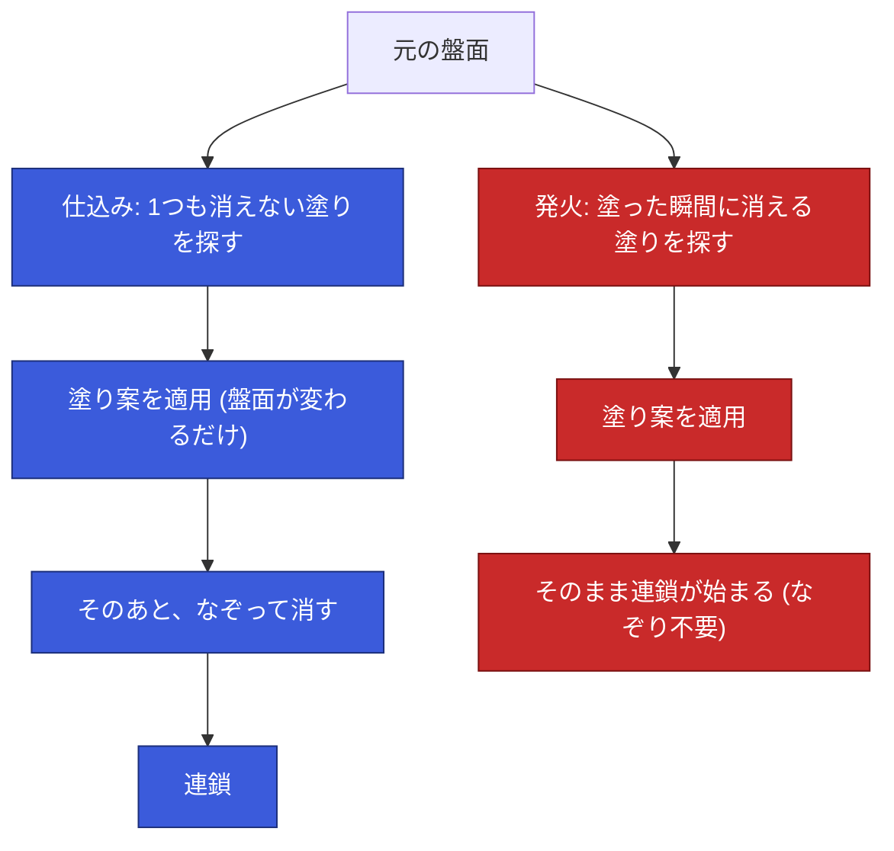
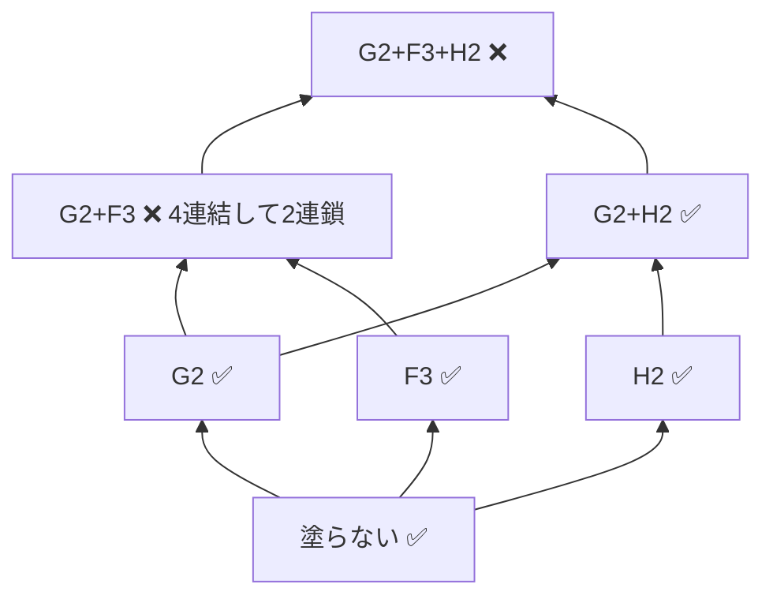
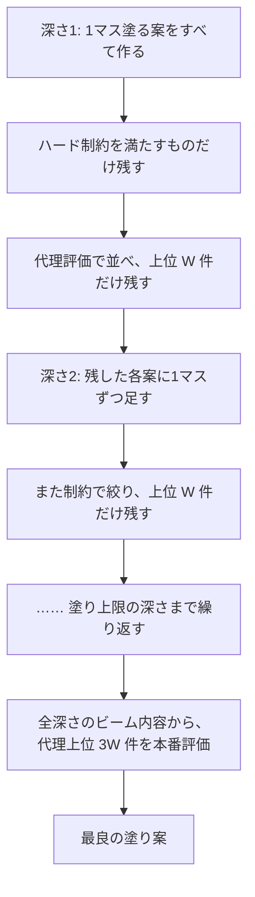
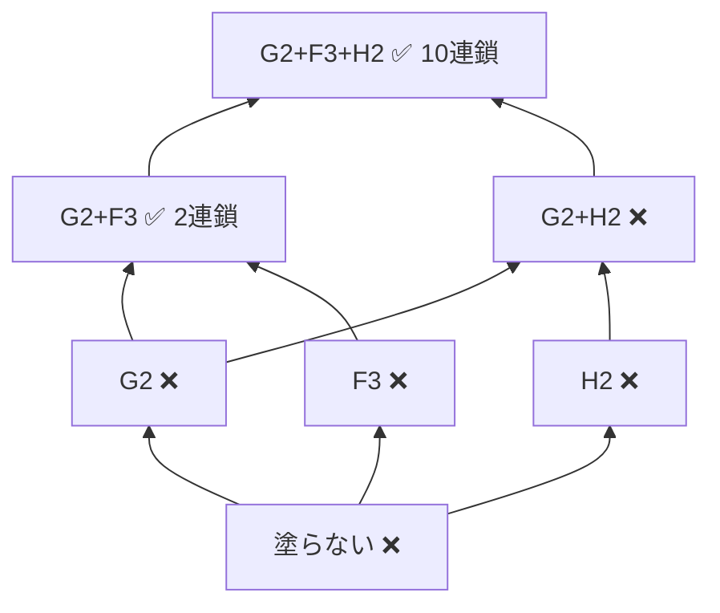
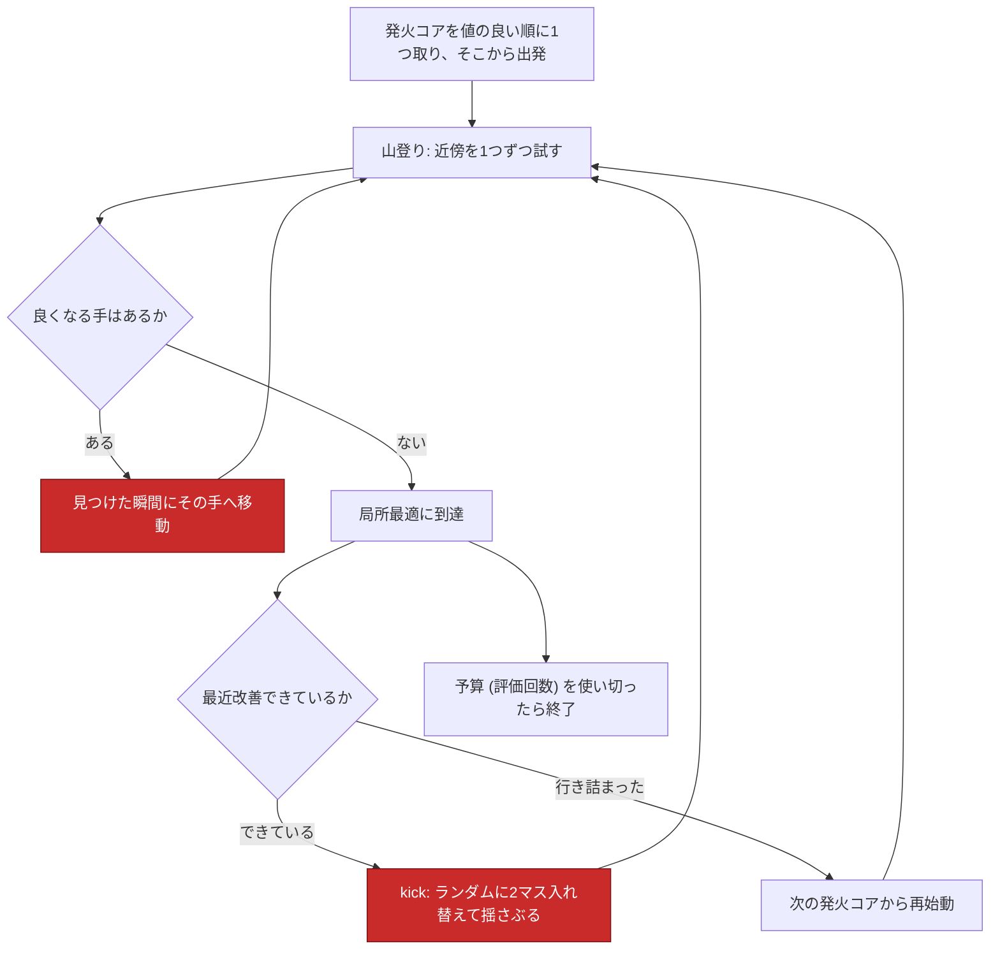
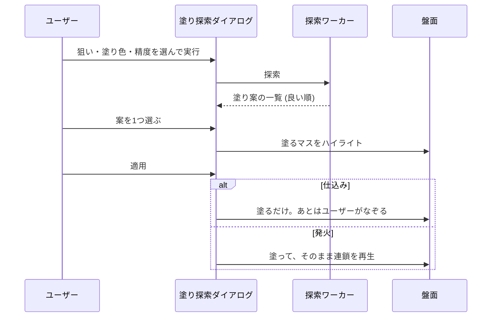

# ぷよ塗り探索の仕組み

盤面のマスを1色に塗り替える手 (**ぷよ塗り**) を自動で探す機能の解説。
狙いが2つあり、**仕込み**と**発火**でまったく別のアルゴリズムが動いている。

> この文書は「何をしているか」の解説です。
> 「なぜそうしたか」と性能の実測値は [調査記録](research/) を参照してください。
> 実装は `packages/solver-wasm/src/paint_search.rs` / `paint_ignition_search.rs`、
> UI 側は `src/logics/paint-search.ts`。

---

## 1. 全体像: 2つの狙い

同じ「1色に塗り替える」でも、**塗った直後に消えてほしいかどうか**が正反対になる。



| | 仕込み | 発火 |
|---|---|---|
| 塗った直後 | **1つも消えない** (ハード制約) | **消える** (ハード制約) |
| 何を評価するか | 塗り後の盤面での**なぞり探索の最良値** | 塗りで起きた**連鎖そのものの値** |
| なぞり | 後段で必要 | 不要 |
| 探索方式 | ビームサーチ | 反復局所探索 (ILS) |
| 1件の評価コスト | 重い (なぞり探索がネストする) | 軽い (連鎖シミュレーション1回) |
| 標準精度の所要時間 (wasm) | 約 232 秒 (14ワーカーに分けて約16秒) | **約 0.5 秒** |

「列挙は発火の方が苦しく、評価は発火の方が遥かに軽い」という、ちょうど対称の性格になっている。

---

## 2. 例に使う盤面

以降の説明はすべて、この盤面ひとつで通す。リポジトリにある実在の盤面
(`src/logics/boards/chainSeed1/1.ts`、れんさのたね1 の1) で、
**この文書に出てくる連鎖数・ダメージ・代理スコアは、すべてこの盤面に対して
本リポジトリのシミュレータとなぞり探索で実際に計算した値**。

```
     A   B   C   D   E   F   G   H
 1   R   H   H   R   R   G   P   B
 2   R   R   P   H   H   R   G   G
 3   G   G   R   Y   R   G   P   P
 4   G   Y   G   B   Y   Y   R   P
 5   B   B   B   R   R   R   Y   B
 6   Y   Y   Y   P   P   P   B   B

 R=赤  B=青  G=緑  Y=黄  P=紫  H=ハート
```

| 設定 | 値 |
|---|---|
| 塗り色 | 赤 |
| 最低消し数 | 4 |
| 探索対象 | 赤ダメージ |
| 塗れるマス | 赤以外の色ぷよ、ハート (ほかに おじゃま・固ぷよ。プリズムと?ぷよは塗れない) |

この盤面は**そのままでは何も消えない** (初期発火が無い)。ぷよ塗り探索はこれを前提にしている。

### 塗り集合

塗るマスの組み合わせ1つを **塗り集合 S** と呼ぶ。8×6 = 48マスから最大10マスを選ぶので、
S の候補は **約87億通り**。この87億をどう減らすかが、両方の探索の勝負どころになる。

```
S = 塗らない
S = C1
S = C1 + E2
S = B1 + C1 + E2   ...
```

---

## 3. 仕込み: 消えない形を作る

### 3-1. ハード制約は「下方閉」なので、有効な塗りだけを直接作れる

最低消し数が4なので、制約「塗り後に1つも消えない」は
「**塗り色の連結成分がすべて3個以下**」と同じ意味になる。

例に使う盤面の右上あたりを見る。E3 と F2 が元から赤なので、その周りを塗ると赤が育つ。

```
塗らない                        S = G2                         S = G2 + F3
     E   F   G   H                  E   F   G   H                  E   F   G   H
 2   H   R   G   G              2   H   R  [R]  G              2   H   R  [R]  G
 3   R   G   P   P              3   R   G   P   P              3   R  [R]  P   P
 4   Y   Y   R   P              4   Y   Y   R   P              4   Y   Y   R   P

 赤の連結成分の大きさ:
 E3=1, F2=1 ✅                 E3=1, F2+G2=2 ✅              E3+F3+F2+G2=4 ❌
```

`G2` だけ、`F3` だけなら赤は3個以下に収まるが、**両方塗ると E3 (元から赤) と繋がって4連結**し、
消えてしまう。シミュレータで確かめると `G2+F3` は実際に2連鎖する。

ここで効くのが「**塗ると塗り色は増える一方で、絶対に減らない**」という事実。
一度違反したら、そこに何を足しても違反のまま。逆から見れば
「**有効な集合の部分集合は必ず有効**」で、これを **下方閉** と呼ぶ。



上に行く (マスを増やす) ほど違反しやすい。だから1マスずつ足していく DFS で、
**違反した瞬間にその枝を丸ごと捨てられる**。

```
DFS:  塗らない → G2 ✅ → G2+F3 ❌  ← ここで打ち切り
                                     この先の何百万通りを1度も作らずに済む
```

「全部作ってから捨てる」のではなく、最初から有効なものしか生成しない。
これで 87億 → 最悪でも1.8億通り、**1件あたり約9ns** になり、列挙は事実上無料になる。

### 3-2. 実際の探索: ビームサーチ

列挙が無料でも、**評価が高い**。1件の評価は「塗り後の盤面でなぞり探索を1回まるごと回す」
ことなので 2ms かかる。候補が最大9,600万件ある盤面では全部評価すると2.5時間になる。

そこでビームサーチを使う。**塗り数を深さとして、各段で良いものだけを残していく。**



#### この盤面で実際に動かすと

ビーム幅 W=3 という極端に狭い設定で追ってみる (実際の既定は300)。
代理は**なぞり4の全探索**、値は赤ダメージ。

**深さ1** — 塗れる36マスのうち、制約を満たしたのは **22マス**。
`B1` や `E2` は塗った瞬間に消えてしまうので、この時点で落ちる。

```
深さ1: 1マスだけ塗ったときの代理スコア (なぞり4・赤ダメージ)

       A     B     C     D     E     F     G     H
 1     R     ✗  [9.4]    R     R     ✗   4.5   4.8
 2     R     R     ✗   7.0     ✗     R  (7.8) (7.8)
 3     ✗     ✗     R   6.2     R  (7.8)  5.9   4.5
 4   5.5   5.5   5.9     ✗     ✗     ✗     R   4.8
 5   6.0   6.0     ✗     R     R     R     ✗   4.8
 6   6.4   6.4   5.5     ✗     ✗     ✗   4.8   4.8

 R = 元から赤   ✗ = 塗ると消えるので落選 (14マス)
 [9.4] = 最高   (7.8) = 同点の2位が3マス   塗らない案 = 7.8
```

上位3件 **C1 / G2 / H2** だけを残す (`F3` も 7.8 の同点だが、幅3からあふれて捨てられる)。

> 代理スコアの同点は普通に起きる。だから比較関数は**全順序**でなければならない
> (同点のとき第1引数を返す実装をソートに渡すと、反対称性が壊れて panic する)。

**深さ2** — 残した3件それぞれに1マス足して 102通りに広げ、制約を満たしたのは **57件**。

| 残った上位 | 代理スコア |
|---|---|
| C1+D3 | 9.4 |
| C1+A4 | 9.4 |
| G2+H2 | 8.2 |

**本番評価 (なぞり6)** — 全深さのビーム内容をまとめて評価し直す。

| 塗り案 | 代理 (なぞり4) | **本番 (なぞり6)** |
|---|---|---|
| **C1 (1マス)** | 9.4 | **9.7** ← 最良 |
| C1+D3 | 9.4 | 9.4 |
| C1+A4 | 9.4 | 9.4 |
| G2+H2 | 8.2 | 8.2 |
| G2 / H2 | 7.8 | 7.8 (塗らないのと同じ) |
| 塗らない | — | 7.8 |

**勝ったのは深さ1の `C1` だった。** これが「最後の段だけでなく、
**全深さのビーム内容から**本番評価に回す」理由になっている。
塗り数を増やせば良くなるとは限らず、最適な塗り数は途中にある。

> 「塗らない」案は代理評価を通らないので、上位選抜に任せると消えてしまう。
> 塗りがすべて損な盤面ではこれが答えになるため、無条件で本番評価に加えている。

### 3-3. 評価が2段構えな理由

全部を本番評価すると高いので、**なぞり数を落とした探索**を代理のふるいに使う。

| | なぞり数 | 1件あたり | 用途 |
|---|---|---|---|
| 代理評価 | 4 | 0.093 ms | ビームの各段で並べ替える。本番の **23倍安い** |
| 本番評価 | 6 (ユーザー設定) | 2 ms | 最後に残った候補だけ |

上の表で `C1` の代理 9.4 に対して本番 9.7 が出ているとおり、代理は**順位を決めるための道具**で、
値そのものは本番と一致しない。なぞり3まで落とすと順位付けの精度が足りず、
「塗り色の連結成分の形だけで点を付ける静的スコア」は位置関係を見ないので完全に失格だった。

**ビーム幅を広げるときは本番評価に回す件数も一緒に広げる** (目安は幅の3倍)。
幅だけ広げると、代理の並びで真の最良が押し出されて逆に悪化する。

### 3-4. 精度プリセット

| 精度 | ビーム幅 | 本番評価 | 備考 |
|---|---|---|---|
| 標準 | 300 | 900 | 既定 |
| 高精度 | 1000 | 3000 | |
| 超高精度 | 2000 | 6000 | **Rustバックエンド限定** (wasm では時間がかかりすぎる) |

wasm は単スレッドなので、ビームの1段を「展開 → 評価を N ワーカーに配る → 集約 → 上位K件」
に分けて回している (重いのは評価だけ)。分割した評価は**必ず元の順序に組み直す**。
順序が崩れると同点の並びが変わり、Rustネイティブバックエンドと結果が食い違う。

---

## 4. 発火: 塗った瞬間に消す

### 4-1. 同じ格子の、ラベルだけが反転する

制約が「塗ったら発火すること」に変わると、§3-1 とまったく同じ集合の ✅❌ がそっくり入れ替わる。

| 塗り集合 | 仕込み (消えない) | 発火 (消える) |
|---|---|---|
| 塗らない | ✅ | ❌ |
| G2 / F3 / H2 | ✅ | ❌ |
| G2+H2 / F3+H2 | ✅ | ❌ |
| G2+F3 | ❌ | ✅ 2連鎖 |
| G2+F3+H2 | ❌ | ✅ 10連鎖 |

有効な集合に何を足してもやはり発火するので、こちらは **上方閉** になる。



下方閉の図と上下が逆で、**上に行くほど有効になりやすい**。これが痛い。

- 「上限いっぱい塗って最大値を狙う」が原則なので、主戦場は**一番上の層**
- ところが上方閉なので、**一番上の層はほぼ全部が有効解**

つまり「制約で枝を切る」という仕込み側の高速化の柱が、まるごと消える。

さらに、**評価値は塗り数に対して単調ではない**。同じ盤面で実際に起きる:

```
S = C1 + E2        →  11連鎖  赤ダメージ 6.5   (48個すべて消えて全消し)
S = C1 + E2 + B1   →   8連鎖  赤ダメージ 4.1   ← マスを足したのに悪化した
```

塗り色を足したせいで塊が早く繋がり、一度に消えすぎて連鎖が短くなる。
「良い部分集合を伸ばせば良い解になる」という保証がない。

### 4-2. だからビームサーチは効かない

ビームサーチが賭けているのは「**良い10マスの解は、良い3マスの解から育つ**」という仮定だが、
発火ではこれが外れる。実測した理由は3つ:

1. **途中の値が最終値を予測しない。** 最適解は100%が「極小」(どの1マスを抜いても悪化する) で、
   95%が上限サイズ。**全マスが噛み合って初めて意味を持つ形**なので、部分集合が
   途中で高得点を出すとは限らない
2. **ビームは足すことしかできない。** 深さ3で `B1` を選んだら最後まで外せない。
   後から「B1 ではなく E2 だった」と分かっても戻せない
3. **結果、正解の芽が幅からこぼれる。** 裾を拾うには幅を5倍にするしかない

評価件数の配分にも出ていて、ビームは**評価の36%しか上限サイズの集合に使えていない**。
答えの95%はそこにあるのに、残りは下の層の道案内に消える。

### 4-3. 採用した方式: 反復局所探索 (ILS)

育てるのではなく **直す**。最初から完成した解を持ち、少しずつ手を入れ続ける。



#### この盤面で1歩ずつ追うと

`B1+C1` という平凡な有効解から出発する (赤ダメージ 1.4)。近傍を試していくと:

```
出発点  S = B1 + C1                          1連鎖   赤ダメージ 1.4
     A   B   C   D   E   F   G   H
 1   R  [R] [R]  R   R   G   P   B      A1〜E1 が A2,B2 と繋がって7連結 → 発火する
 2   R   R   P   H   H   R   G   G      が、上の塊が消えるだけで終わる
```

| 近傍 | 手 | 結果 | 受理 |
|---|---|---|---|
| **入替** | B1 を **E2** に換える | **11連鎖 / 6.5** (全消し) | ✅ 移動する |
| 追加 | そこへ B1 を足し戻す | 8連鎖 / 4.1 | ❌ 悪化 |
| 削除 | そこから C1 を抜く | 11連鎖 / 6.3 | ❌ わずかに悪化 |

```
入替後  S = C1 + E2                          11連鎖  赤ダメージ 6.5
     A   B   C   D   E   F   G   H
 1   R   H  [R]  R   R   G   P   B      C1,D1,E1 が E2 を介して
 2   R   R   P   H  [R]  R   G   G      E2,F2,E3 と繋がって発火する。
 3   G   G   R   Y   R   G   P   P      A1,A2,B2 は B1 を塗らないので巻き込まれない
```

**肝は「入替」。** ビームに決定的に欠けていた修正操作がこれで、
`B1` を選んでしまった失敗を、完成した解の状態から取り消せる。

| 近傍 | 内容 | おおよその手数 |
|---|---|---|
| 追加 | 1マス足す | 約 29 |
| 削除 | 1マス抜く | 約 10 |
| **入替** | 1マスを別のマスに換える | 約 290 |

**良くなる手を見つけた瞬間に進む** (first-improvement) のもわざと。
近傍329手を全部見てから一番良い1手に進む (best-improvement) と1歩に329評価かかるが、
first なら数手〜数十評価で1歩進める。同じ予算なら**何倍も歩数を稼げる**方が勝つ。
結果、**評価の59%が上限サイズの集合に当たる** (ビームは36%)。

#### 出発点の「発火コア」

**任意の有効解は、4マス以下の「発火コア」を部分集合として含む。**
初期発火が無く最低消し数が4なら、塗り後に発火した塗り色成分から連結4マスを取り、
そこから元々塗り色だったマスを除いたものがコアになる。

8×6盤面の連結4マス領域は **553通りしかない**ので、コアを全列挙すれば
**発火の起点を数百件で完全に網羅できる** (実運用盤面で平均455件)。
これは「ビームの種」としては効かなかったが、**ILS の再始動プール**としてそのまま使っている。

### 4-4. どれだけ効いたか

同じ評価回数でビームと比べた実測 (実運用サイズ・300盤面・最良既知値との一致率):

| 評価回数 | ビーム | **ILS** |
|---|---|---|
| 56,267 (幅300相当) | 28.3% / 273ms | **87.0% / 204ms** |
| 160,721 (幅1000相当) | 35.0% / 813ms | **90.0% / 625ms** |

**同じ評価回数で品質が大きく上回り、しかも速い。**

### 4-5. 精度プリセット

幅という概念が無いので、**評価回数そのもの**で切る。

| 精度 | 評価回数 | wasm 実時間 | 品質 (基準比) |
|---|---|---|---|
| 標準 | 16万 | 約 0.5 秒 | 0.956 |
| 高精度 | 50万 | 約 1.7 秒 | 0.981 |
| 超高精度 | 150万 | 約 5.6 秒 | 0.995 |

**発火は超高精度まで wasm で選べる** (仕込みの標準 約232秒より、発火の超高精度 5.6秒の方が短い)。
ワーカー分割も進捗バーも要らないので、1呼び出しで完結させている。

色による差は無いが、**カテゴリによる差は大きい**。スキル溜め (0.999) や
ぷよ使いカウント (0.996) はほぼ解けていて、難しいのはダメージだけ
(連鎖倍率と同時消し倍率が掛け算で効くので、1マスの違いで大きく変わる)。
プリセットはダメージに合わせてある。

---

## 5. 不確定ぷよ (期待値) の扱い

シミュレータは、ネクストが落ちたあとの空きマスを埋めない。実際には色ぷよが降ってきて
連鎖が伸び得るので、この決定論評価は系統的に過小評価になる。

どちらの狙いでも、**探索は決定論のまま走らせ、最終選抜だけ期待値で並べ替える**。
効き幅 (仕込み 最大+3.8% / 発火 約+1%) に対して、探索の内側で使うと
比較のたびにサンプル数ぶんの計算が乗って割に合わないため。

> 発火側は概念としても筋が良い。仕込みには「補充を見てからなぞりを選べてしまう」
> 上振れする期待値と、実プレイに対応する期待値の2種類があったが、発火は選ぶものが
> 塗り集合しか無いので、期待値が1通りに定まる。

---

## 6. UI での流れ



- 仕込みの案で連鎖を起こしてはいけない。**発火させないのがハード制約**で、
  そのあとユーザーがなぞる前提の盤面だから
- 発火の案は「塗った時点でもう消える状態」なので、塗るだけで止めると
  「消えるはずなのに消えていない」不自然な盤面が残る。実際のゲームと同じく連鎖を流す
- 多段塗り (紫 → 青 → 消し) は「適用してもう一度塗探索を開く」で自然に実現される。
  適用の取り消しは1手分だけ持つ
- 探索結果と取り消し履歴は**どの入力に対するものか**を指紋で持っていて、
  盤面が変わったら古い結果を捨てる

---

## 関連ドキュメント

| ドキュメント | 内容 |
| --- | --- |
| [ぷよ塗り探索の設計と実測](research/paint-search.md) | 仕込み側の方式選定。却下した候補フィルタ・代理評価・枝刈りと、その実測値 |
| [塗り発火探索の設計メモ](research/paint-ignition-search.md) | 発火側の方式選定。下方閉/上方閉の詳しい図解、ビームが効かない原因の診断、ILS の実測 |
| [なぞり消し探索ソルバの高速化](research/solver-optimization.md) | 後段のなぞり消し探索そのものの計算量と定数倍最適化 |
